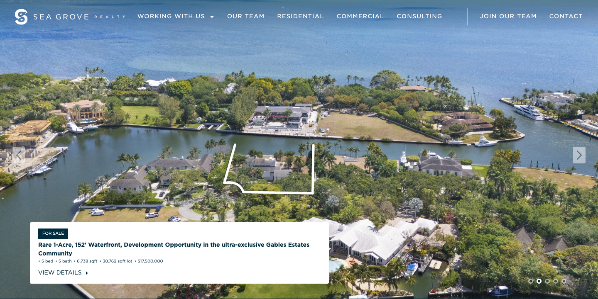
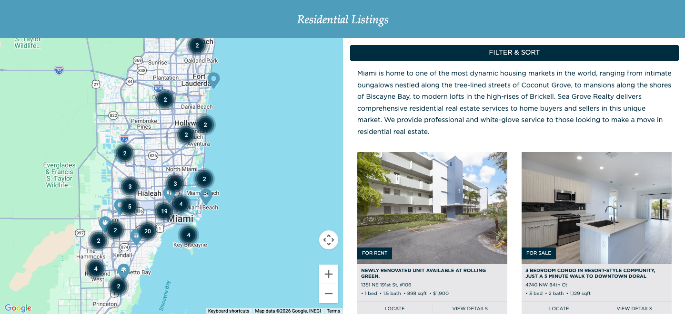

# Sea Grove

A WordPress theme for real estate and property listings, with agent profiles, property maps, and marketing pages.

**Author:** r@ndi  
**Version:** 1.0.0  
**License:** GNU General Public License v2 or later

---

## Screenshots



*Screenshot 1 — Home or main view*



*Screenshot 2 — Listings or map*


*Screenshot 3 — Agent or detail view*

---

## Description

Sea Grove is a custom WordPress theme built for real estate and agent-focused sites. It includes:

- **Home:** Hero slider, intro section, about content, and banner
- **Property listings & map:** Interactive map with filters and list view
- **Agent profiles:** Buy/Sell/Home agent templates with contact info
- **Team page:** Team members grid
- **Contact:** Contact form and info
- **Marketing & consulting:** Marketing and partnership pages

The theme uses custom fonts (Gotham, Palatino), responsive layouts, and integrates with common WordPress plugins.

---

## Requirements

- WordPress 5.0+
- PHP 7.4+

---

## Installation

1. Upload the `seagrove-wp-theme` folder to `wp-content/themes/`.
2. In the WordPress admin, go to **Appearance → Themes** and activate **Sea Grove**.
3. Configure menus under **Appearance → Menus** (Main Navigation Left, Main Navigation Right, Footer Navigation).
4. (Optional) Copy `.env.example` to `.env.php` in the theme root if you use environment-specific config.

---

## Development

### Assets (CSS/JS)

Front-end assets are built from `assets/src/`. To rebuild:

```bash
cd assets
npm install
npm run build
```

Watch mode for development:

```bash
npm run watch
```

### Composer

PHP dependencies (e.g. Sentry) are managed with Composer:

```bash
composer install
```

---

## Theme structure

- `assets/` – Source and built CSS/JS (webpack)
- `inc/` – Template tags, Jetpack integration
- `template-parts/` – Reusable template parts
- `*.php` – Core templates (header, footer, front-page, page templates)
- `style.css` – Theme header and main styles

---

## License

GNU General Public License v2 or later. See [LICENSE](LICENSE) if present.
